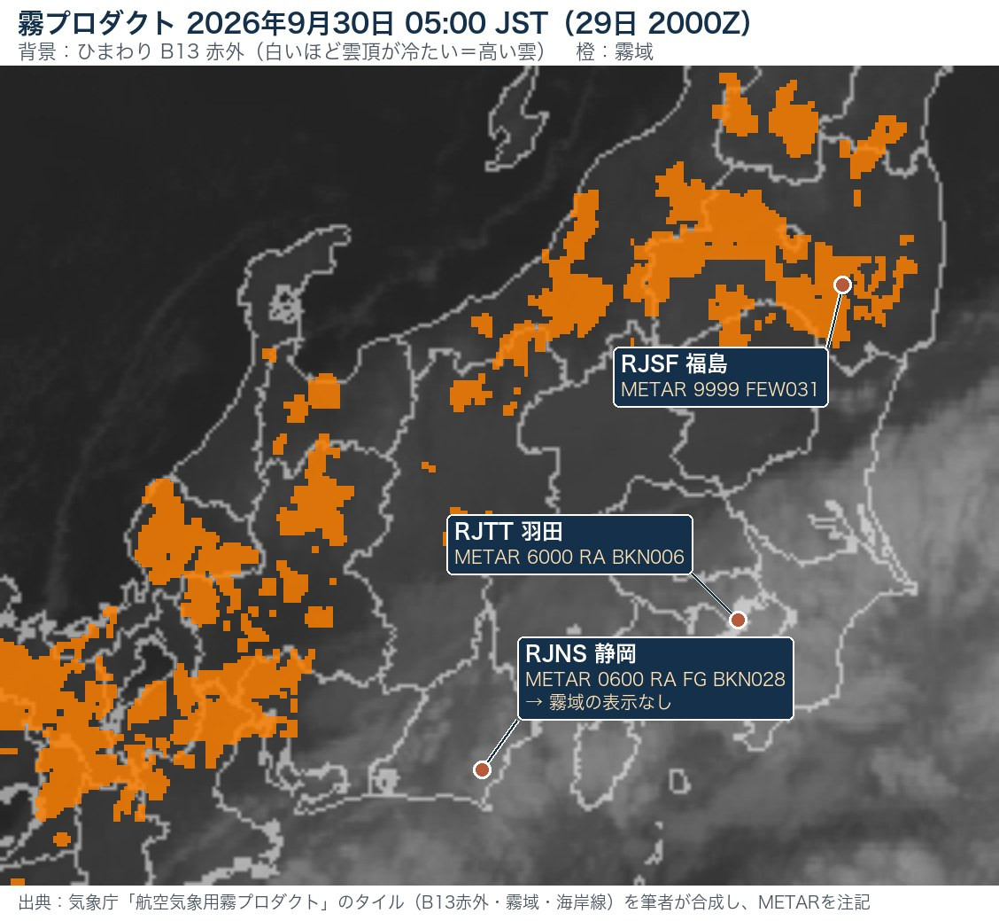
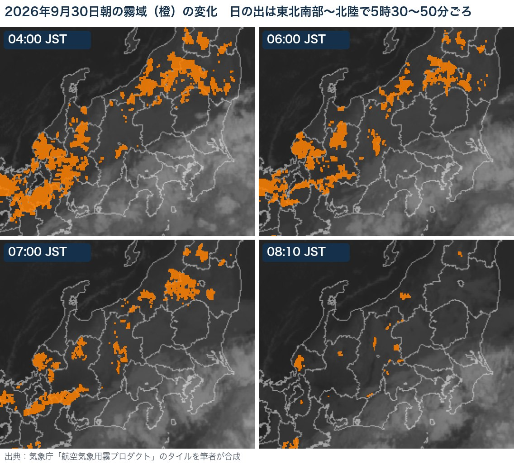

霧の情報は、ふつうは**点**でしか手に入りません。METARは空港の上、ライブカメラはそのカメラの前、アメダスは視程を測りません。

その「点」を**面**にしてくれるのが、気象庁の **[航空気象用霧プロダクト](https://www.data.jma.go.jp/omaad/aviation/jp/fog/)** です。気象衛星ひまわりの画像の上に、**霧と判定された場所が橙色で**重ねて表示されます。

無料で、登録も要りません。今回は、このページの見方と、**何を根拠に霧と判定しているのか・どのくらい当たるのか**を、気象衛星センターの技術報告から整理しました。最後に、**2026年9月30日の朝**の実例で、映る霧と映らない霧を確かめます。

---

## ① どこにあって、何が表示されるのか

### たどり方

気象庁の **[航空気象情報](https://www.data.jma.go.jp/airinfo/index.html)** のページ →「**実況・解析情報**」の表 →「**気象衛星プロダクト**」の行に、**霧プロダクト**と**積乱雲情報**が並んでいます。

URLを直接ブックマークしてもかまいません。**表示している範囲と要素はURLの「#」以降に保存される**ので、自分がよく飛ぶ地域を拡大した状態でブックマークしておくと便利です。スマートフォンでは自動でスマホ用の画面に切り替わります。

### 画面の中身

| 項目 | 内容 |
|---|---|
| **背景** | ひまわりの**赤外画像（バンド13、10.4µm）**。白いほど雲頂が冷たい＝高い雲 |
| **橙色** | **霧域**（霧と判定された格子） |
| **更新間隔** | **5分ごと** |
| **さかのぼれる時間** | **約12時間分**（5分間隔で145コマ） |
| **格子の大きさ** | **0.02度**（約2km） |
| **表示範囲** | 日本周辺のみ |
| **時刻表示** | 日本時間（JST） |

凡例の下には、次の注意書きが常に出ています。

> ※衛星観測に基づく霧判定のため、**雲の下に隠れた霧は衛星から見えないので表示できません。**

この一文が、このプロダクトを使ううえでいちばん大事なポイントです。あとで実例で確かめます。

### 操作

右上の「？」ボタンで操作の説明が出ます。覚えておくと便利なものだけ挙げます。

| 操作 | 動作 |
|---|---|
| **Shift＋← / →** | 表示時刻を5分ずつ戻す／進める |
| **Shift＋Enter** | 最新の時刻に戻る |
| **Ctrl＋Enter**（Macは control） | 動画の再生／停止 |
| **Shift＋ドラッグ** | 選んだ四角形に拡大 |
| **Shift＋S** | 画像を保存 |

霧は**動きが遅く、形の変化も緩やか**なので、1枚だけで見るより**動画で広がり方・消え方を見る**ほうが判断しやすい、と気象衛星センターの解説書にもあります。

---

## ② どうやって「霧」と判定しているのか

根拠になる資料は、<strong>気象衛星センター技術報告 第66号（2022年10月）</strong>の「ひまわり８号霧監視プロダクトの開発」（丸山・石田・中鉢）です。

### 衛星だけでは「霧」と「低い雲」を区別できない

報告の出発点はここです。

> 衛星は雲域を上空から観測するため、衛星観測のみから霧と霧ではない下層雲（**雲底が地表に接しているかいないか**）を区別することは困難である。

上から見ると、<strong>地面に接している霧も、地上300mに浮いている層雲も、同じ「低くて平らな雲」</strong>に見えます。操縦士にとっては、この2つは意味がまったく違います。

そこで霧プロダクトは、**ひまわりの観測で「霧を含む低い雲」を抜き出したあと、数値予報モデル（MSM）の地上付近の気温・湿度を使って「地面に接していそうか」を判定する**、という2段構えになっています。

### 判定の流れ

<svg viewBox="0 0 560 470" width="100%" role="img" aria-label="霧プロダクトの判定フロー：上中層雲の除外、昼夜判別、下層雲の抽出、霧の検出">
<rect x="0" y="0" width="560" height="470" fill="#ffffff"/>
<text x="14" y="24" font-family="system-ui,-apple-system,'Hiragino Sans','Noto Sans JP',sans-serif" font-size="15" font-weight="700" fill="#14304a">霧プロダクトの判定フロー</text>
<text x="14" y="42" font-family="system-ui,-apple-system,'Hiragino Sans','Noto Sans JP',sans-serif" font-size="10.5" fill="#4b5563">気象衛星センター技術報告 第66号（2022）図2・表3をもとに作図</text>
<defs><marker id="fa" viewBox="0 0 10 10" refX="9" refY="5" markerWidth="7" markerHeight="7" orient="auto"><path d="M0,0 L10,5 L0,10 z" fill="#6b7280"/></marker></defs>
<rect x="40" y="56" width="480" height="62" rx="6" fill="#ffffff" stroke="#14304a" stroke-width="1.6"/>
<rect x="40" y="56" width="5" height="62" rx="2" fill="#14304a"/>
<text x="54" y="75" font-family="system-ui,-apple-system,'Hiragino Sans','Noto Sans JP',sans-serif" font-size="12.5" font-weight="700" fill="#1f2937">① 上中層雲がある格子を除外</text>
<text x="510" y="75" text-anchor="end" font-family="system-ui,-apple-system,'Hiragino Sans','Noto Sans JP',sans-serif" font-size="10" fill="#14304a">衛星＋MSM</text>
<text x="54" y="93" font-family="system-ui,-apple-system,'Hiragino Sans','Noto Sans JP',sans-serif" font-size="11" fill="#4b5563">B13の雲頂温度が MSM 700hPa 気温より高い（雲頂が約3,000mより低い）</text>
<text x="54" y="109" font-family="system-ui,-apple-system,'Hiragino Sans','Noto Sans JP',sans-serif" font-size="11" fill="#4b5563">かつ MSM 700hPa 相対湿度 90% 未満（＝上中層雲なし）</text>
<line x1="280" y1="118" x2="280" y2="134" stroke="#6b7280" stroke-width="1.5" marker-end="url(#fa)"/>
<rect x="40" y="134" width="480" height="44" rx="6" fill="#ffffff" stroke="#4b5563" stroke-width="1.6"/>
<rect x="40" y="134" width="5" height="44" rx="2" fill="#4b5563"/>
<text x="54" y="153" font-family="system-ui,-apple-system,'Hiragino Sans','Noto Sans JP',sans-serif" font-size="12.5" font-weight="700" fill="#1f2937">② 昼夜を判別</text>
<text x="510" y="153" text-anchor="end" font-family="system-ui,-apple-system,'Hiragino Sans','Noto Sans JP',sans-serif" font-size="10" fill="#4b5563"></text>
<text x="54" y="171" font-family="system-ui,-apple-system,'Hiragino Sans','Noto Sans JP',sans-serif" font-size="11" fill="#4b5563">太陽天頂角 87° 未満＝日中、87° 以上＝夜間</text>
<line x1="160" y1="178" x2="160" y2="196" stroke="#6b7280" stroke-width="1.5" marker-end="url(#fa)"/>
<line x1="400" y1="178" x2="400" y2="196" stroke="#6b7280" stroke-width="1.5" marker-end="url(#fa)"/>
<rect x="40" y="196" width="236" height="98" rx="6" fill="#ffffff" stroke="#a07000" stroke-width="1.6"/>
<rect x="40" y="196" width="5" height="98" rx="2" fill="#a07000"/>
<text x="54" y="215" font-family="system-ui,-apple-system,'Hiragino Sans','Noto Sans JP',sans-serif" font-size="12.5" font-weight="700" fill="#1f2937">③ 下層雲を抽出（日中）</text>
<text x="266" y="215" text-anchor="end" font-family="system-ui,-apple-system,'Hiragino Sans','Noto Sans JP',sans-serif" font-size="10" fill="#a07000">衛星</text>
<text x="54" y="233" font-family="system-ui,-apple-system,'Hiragino Sans','Noto Sans JP',sans-serif" font-size="11" fill="#4b5563">可視 B03 反射率/cos(天頂角) ≧ 0.3</text>
<text x="54" y="249" font-family="system-ui,-apple-system,'Hiragino Sans','Noto Sans JP',sans-serif" font-size="11" fill="#4b5563">　→ 雲がある</text>
<text x="54" y="265" font-family="system-ui,-apple-system,'Hiragino Sans','Noto Sans JP',sans-serif" font-size="11" fill="#4b5563">近赤外 B05/B04 ≧ 0.5</text>
<text x="54" y="281" font-family="system-ui,-apple-system,'Hiragino Sans','Noto Sans JP',sans-serif" font-size="11" fill="#4b5563">　→ 雪氷ではない（水の雲）</text>
<rect x="284" y="196" width="236" height="98" rx="6" fill="#ffffff" stroke="#3a7ca5" stroke-width="1.6"/>
<rect x="284" y="196" width="5" height="98" rx="2" fill="#3a7ca5"/>
<text x="298" y="215" font-family="system-ui,-apple-system,'Hiragino Sans','Noto Sans JP',sans-serif" font-size="12.5" font-weight="700" fill="#1f2937">③ 下層雲を抽出（夜間）</text>
<text x="510" y="215" text-anchor="end" font-family="system-ui,-apple-system,'Hiragino Sans','Noto Sans JP',sans-serif" font-size="10" fill="#3a7ca5">衛星</text>
<text x="298" y="233" font-family="system-ui,-apple-system,'Hiragino Sans','Noto Sans JP',sans-serif" font-size="11" fill="#4b5563">B07(3.9µm) − B13 ≦ −1.5℃</text>
<text x="298" y="249" font-family="system-ui,-apple-system,'Hiragino Sans','Noto Sans JP',sans-serif" font-size="11" fill="#4b5563">　→ 水滴の雲</text>
<text x="298" y="265" font-family="system-ui,-apple-system,'Hiragino Sans','Noto Sans JP',sans-serif" font-size="11" fill="#4b5563">B13 ≧ −10℃</text>
<text x="298" y="281" font-family="system-ui,-apple-system,'Hiragino Sans','Noto Sans JP',sans-serif" font-size="11" fill="#4b5563">　→ 雲頂が低い</text>
<line x1="160" y1="294" x2="240" y2="316" stroke="#6b7280" stroke-width="1.5" marker-end="url(#fa)"/>
<line x1="400" y1="294" x2="320" y2="316" stroke="#6b7280" stroke-width="1.5" marker-end="url(#fa)"/>
<rect x="40" y="316" width="480" height="94" rx="6" fill="#ffffff" stroke="#b65a3b" stroke-width="1.6"/>
<rect x="40" y="316" width="5" height="94" rx="2" fill="#b65a3b"/>
<text x="54" y="335" font-family="system-ui,-apple-system,'Hiragino Sans','Noto Sans JP',sans-serif" font-size="12.5" font-weight="700" fill="#1f2937">④ 霧かどうかを判定（地上に接しているか）</text>
<text x="510" y="335" text-anchor="end" font-family="system-ui,-apple-system,'Hiragino Sans','Noto Sans JP',sans-serif" font-size="10" fill="#b65a3b">衛星＋MSM</text>
<text x="54" y="353" font-family="system-ui,-apple-system,'Hiragino Sans','Noto Sans JP',sans-serif" font-size="11" fill="#4b5563">MSM 地上相対湿度 ≧ 85%</text>
<text x="54" y="369" font-family="system-ui,-apple-system,'Hiragino Sans','Noto Sans JP',sans-serif" font-size="11" fill="#4b5563">MSM 地上気温 − B13 雲頂温度 ≦ 10℃（雲頂が地面の温度に近い＝雲頂が低い）</text>
<text x="54" y="385" font-family="system-ui,-apple-system,'Hiragino Sans','Noto Sans JP',sans-serif" font-size="11" fill="#4b5563">MSM 地上相対湿度 ≧ 925・850・700hPa の相対湿度（地上がいちばん湿っている）</text>
<text x="54" y="401" font-family="system-ui,-apple-system,'Hiragino Sans','Noto Sans JP',sans-serif" font-size="11" fill="#4b5563">→ すべて満たせば「霧域」として橙色で表示</text>
<text x="14" y="436" font-family="system-ui,-apple-system,'Hiragino Sans','Noto Sans JP',sans-serif" font-size="10.5" fill="#4b5563">※ ①で除外された格子（上中層雲の下）は、霧があっても表示されない。</text>
<text x="14" y="454" font-family="system-ui,-apple-system,'Hiragino Sans','Noto Sans JP',sans-serif" font-size="10.5" fill="#4b5563">※ 日中の B05/B04 条件のため、氷霧は検出対象外。MSM は FT=3 以降を時間内挿し、3時間ごとに切り替え。</text>
</svg>

ポイントを補足します。

- **①上中層雲の除外**：雲頂温度が700hPa（約3,000m）の気温より低い、つまり**高い雲がかかっている格子は、そもそも判定しません**。ここで外れた格子は、下に霧があっても橙色になりません
- **③日中と夜間で使うバンドが違う**：日中は**可視・近赤外**（Natural color RGBと同じバンド）、夜間は**3.9µmと10.4µmの差**（Night microphysics RGBにも使われる組み合わせ）です。水滴の雲は3.9µmで放射率が下がり、10.4µmより低い温度に見える性質を使っています
- **④霧の判定**：MSMの**地上の相対湿度が85%以上**、**地上気温と雲頂温度の差が10℃以内**（雲頂が地面に近い＝低い）、**地上が上空（925・850・700hPa）よりも湿っている**——の3条件をすべて満たしたときに霧とします
- MSMは**予報時間3時間以降の値を時間内挿**して使い、**3時間ごと**（00・03・06…UTC）に新しい初期時刻の予報に切り替えています

RGB合成画像で霧を見る場合は、**日の出・日の入りの前後で画像の色合いが変わる**ため、昼用と夜用の画像を見比べる必要があります。霧プロダクトは、その切り替えを中で済ませてくれるので、**昼夜を意識せずに同じ見た目で監視できる**——これが報告のいう利点のひとつです。

---

## ③ どのくらい当たるのか

報告では、2016年8月〜2017年7月の1年間について、<strong>地上の目視観測（SYNOP）と船舶の観測（SHIP）</strong>と突き合わせて精度を評価しています。

| | 日中・陸上 | 日中・海上 | 夜間・陸上 | 夜間・海上 |
|---|---|---|---|---|
| 霧を観測した事例数 | 887 | 33 | 1,245 | 37 |
| **スレットスコア** | 0.306 | 0.237 | 0.324 | 0.375 |
| **空振り率** | 0.562 | 0.705 | 0.580 | 0.475 |
| **見逃し率** | 0.496 | 0.455 | 0.413 | 0.432 |

（気象衛星センター技術報告 第66号 表4より。空振り率＝橙色の格子のうち実際は霧でなかった割合、見逃し率＝観測された霧のうち橙色にならなかった割合）

数字を操縦士の言葉に直すと、こうなります。

- <strong>橙色でも、半分以上は「霧ではない低い雲」</strong>の可能性がある（空振り率5〜7割）
- **観測された霧の4〜5割は、橙色にならない**（見逃し率4〜5割）
- **季節では冬の成績が悪い**（霧の事例が少なく、空振りが増える。氷霧を検出できないことも一因）

さらに大事な注記があります。この評価は、**①で「上中層雲あり」とされた事例を除いた残りで計算しています**。除かれた霧の事例は、<strong>地上で霧が観測された全事例のうち、日中で59%、夜間で52%</strong>でした。

つまり、**上の見逃し率は「空が見えているときの霧」についての数字**で、雲の下の霧は最初から勘定に入っていません。

それでも、衛星だけで判定した場合と比べると、MSMを組み合わせることで**スレットスコアが日中で約2.9倍、夜間で約2倍**になったとされています。<strong>「完璧ではないが、衛星画像を眺めるだけよりは確実に絞り込める」</strong>道具、と受け取るのがよさそうです。

---

## ④ 映らない霧、間違えやすい時間帯

報告の「利用上の留意点」を、そのまま5つに整理します。

| # | 留意点 | 理由 |
|---|---|---|
| a | **上中層雲の下にある霧は検出できない** | 衛星から見えない |
| b | **氷霧は検出できない** | 雪氷面と区別できないので、水滴の霧だけを対象にしている |
| c | **数値予報の精度に左右される** | MSMの地上気温・湿度が実況と大きくずれると判定もずれる |
| d | **小さな霧・ごく薄い霧は検出が難しい** | 赤外バンドの解像度は衛星直下で約2km。地面が透けるほど薄い霧も捉えにくい |
| e | **日の出・日の入りの時間帯に誤検出が増える** | 太陽の角度が低いと地面が明るく見え、日中の判定の閾値を超えてしまうことがある。陸上では日の入りより日の出の時間帯のほうが誤検出しやすいと推察されている |

e は、図で見ると**昼夜の境目に沿って直線状に途切れた、不自然な霧域**として現れることがあるそうです。朝の出発前に見る機会が多いプロダクトなので、**日の出前後の急な広がりには少し疑いを持つ**のがよいと思います。

---

## ⑤ 実例：2026年9月30日の朝

この記事を書いている当日（2026年9月30日）の朝は、ちょうど**2種類の霧**が同時にありました。

- **関東〜東海**：雨で低い雲に覆われ、静岡・羽田・中部では**雨の中の霧・もや**
- **北陸・長野・東北南部の内陸**：空が晴れ、盆地や平野に**霧**（晴れた夜の冷え込みによる放射霧とみられる）

**05時（JST）の時点**を見ると、違いがはっきり出ています。

- <strong>静岡空港（RJNS）</strong>は、METARで**視程600m・RA FG**を報じていました。しかし霧プロダクトでは**霧域の表示なし**。背景の赤外画像では空港の上空が**灰色〜白っぽい＝雲がかかっている**状態で、判定の①で除外されたと考えられます。**これが「雲の下の霧は映らない」の実例**です
- <strong>羽田（RJTT）</strong>も雨と低い雲で、視程6,000m。こちらも霧域は出ていません
- 一方、**雲のない内陸**では、盆地や平野に沿って橙色の霧域が広がっています
- <strong>福島空港（RJSF）</strong>の05時のMETARは**視程9999**で、空港の周りに霧域が迫っている状態でした。1時間後の06時には**BR（もや）で視程5,000m**を報じています。霧プロダクトは**格子が約2km**なので、「空港のすぐ横まで霧」と「空港に霧」を見分けられるほど細かくはありません

時間を追うと、**日の出（この日は東北南部〜北陸で5時30〜50分ごろ）のあと、霧域は同じ場所で縮んでいき、8時過ぎにはほとんど消えています**。放射霧は「朝になって太陽光が当たり始めると急速に消散する」という解説書の説明どおりの動きです。

なお、**04時と06時で霧域の形がかなり違う**のは、霧そのものの変化に加えて、**夜間用の判定から日中用の判定への切り替わり**（④のe）も影響している可能性があります。1日の事例なので、これ以上のことは言えません。

---

## ⑥ ヘリ・小型機で使うなら

ここからは私の考えです。

### 向いている使い方

- **早朝の出発前に、経路上の盆地・谷がどうなっているかを「面」で見る**。METARのない場外離着陸場や、経路上の峠の手前の盆地など、点の情報がない場所こそ役に立ちます
- **動画で「広がっているのか、縮んでいるのか」を見る**。同じ場所で広がっていくなら放射霧、濃淡の模様がまとまって動いていくなら移流霧、という見分け方も解説書に載っています
- **日の出後、霧域が縮んでいくのを確認してから出る**判断材料にする

### やってはいけない読み方

- **「橙色がない＝霧はない」と読まない**。まず**背景の赤外画像を見て、その場所に雲がかかっていないか**を確かめます。白や灰色の雲がかかっていれば、<strong>霧プロダクトはその場所を「見ていない」</strong>のと同じです
- **これは実況の解析で、予報ではない**。これから霧が出るかどうかは、[TAF・飛行場時系列予報](/blog/awfo-taf-timeseries-2026/)や[下層悪天予想図](/blog/lowlevel-sigwx-2026/)で判断します
- **空港の視程は必ずMETAR・ATIS・RVRで**。約2kmの格子は、滑走路の上に霧があるかどうかを言える細かさではありません

### あわせて見たいもの

- **気象衛星センターの[ひまわりリアルタイム画像](https://www.data.jma.go.jp/mscweb/data/himawari/sat_img.php?area=jpn)**（日本域）：**Night Microphysics RGB**（夜間の霧・下層雲が明るい青緑色）や **Day Snow-Fog RGB**、Natural Color RGB を選べます。霧プロダクトの判定を、元の画像で確かめられます
- **同じ「気象衛星プロダクト」の[積乱雲情報](https://www.data.jma.go.jp/omaad/aviation/jp/cci/)**：夏場の午後はこちら

霧の厚さは一般に**数百メートル以下**で、上から見ると山や丘が霧の上に突き出しています。**上空が晴れていて霧の上は飛べても、降りる場所が霧の底**、ということは珍しくありません。霧プロダクトは、そうした状況を**出発前に地図の上で見せてくれる**道具だと思います。

---

## まとめ

| 項目 | 内容 |
|---|---|
| **何か** | ひまわり＋MSMで霧域を判定し、赤外画像の上に**橙色**で表示する気象庁のページ |
| **更新** | **5分ごと**、約12時間分をさかのぼれる、格子は約2km |
| **仕組み** | ①上中層雲を除外 → ②昼夜判別 → ③衛星で低い雲を抽出 → ④MSMの地上湿度・気温で「地面に接しているか」を判定 |
| **精度** | スレットスコア約0.3、**見逃し率4〜5割、空振り率5〜7割**（空が見えている場合の数字） |
| **映らない霧** | **上中層雲の下の霧**、氷霧、小さな霧・薄い霧 |
| **注意する時間帯** | **日の出・日の入り前後**は誤検出が増えやすい |
| **使い方** | 背景の雲を先に見る。予報ではなく実況。空港の視程はMETAR・RVRで |

---

### 関連記事

- [MSMとGSM——モデルの出力は、そのままでは予報になっていない](/blog/msm-gsm-guidance-2026/)
- [下層悪天予想図とは——SFC〜FL150を網羅する小型機・ヘリ運航者の必須資料](/blog/lowlevel-sigwx-2026/)
- [飛行場時系列予報はどう作られる？——数値予報・ガイダンス・予報官の関係を解説](/blog/awfo-taf-timeseries-2026/)
- [RVR（滑走路視距離）とは——METARとATISでの「報じられ方」を読み解く](/blog/rvr-metar-atis-2026/)
- [LVPとLVPDとは何か——「上がれるが、戻れない」という日本独自の体制](/blog/lvp-lvpd-2026/)
- [「もう少しだけ」が命取り——霧の中のヘリコプター飛行が教えてくれること](/blog/hikou-kiroku-01/)

### 出典

- 気象庁「[航空気象用霧プロダクト](https://www.data.jma.go.jp/omaad/aviation/jp/fog/)」（ページの設定ファイル・凡例・操作説明を含む）
- 気象庁「[航空気象情報](https://www.data.jma.go.jp/airinfo/index.html)」——実況・解析情報／気象衛星プロダクト
- 丸山拓海・石田春磨・中鉢幸悦「[ひまわり８号霧監視プロダクトの開発](https://www.data.jma.go.jp/mscweb/technotes/msctechrep66-j.pdf)」気象衛星センター技術報告 第66号（2022年10月）——判定フロー・閾値・精度・利用上の留意点
- 気象衛星センター「[気象衛星画像の解析と利用](https://www.data.jma.go.jp/mscweb/technotes/msctechrep-sp_202203.pdf)」気象衛星センター技術報告 特別号（2022）——6.4節 霧、1.2節 差分画像
- 青森地方気象台「[気象庁ホームページの使い方（青森県版）：気象衛星画像（航空向け霧検出画像）](https://www.data.jma.go.jp/aomori/jmahp-usage/D2/JMA_HP_D2-6.html)」
- METAR：RJNS・RJTT・RJSF（2026年9月29日2000Z〜2100Z）

*本記事は2026年9月30日時点の内容に基づきます。ページの仕様は変更される可能性があります。実例の図は、気象庁の公開タイルを筆者が合成・注記したものです。*

ヒーロー画像：「Echizen Ono Castle」by Keisuke MAEDA（[Wikimedia Commons](https://commons.wikimedia.org/wiki/File:Echizen_Ono_Castle.jpg) / CC BY-SA 4.0）。大野盆地の朝霧に浮かぶ越前大野城。掲載にあたり切り抜きとリサイズを行いました。
