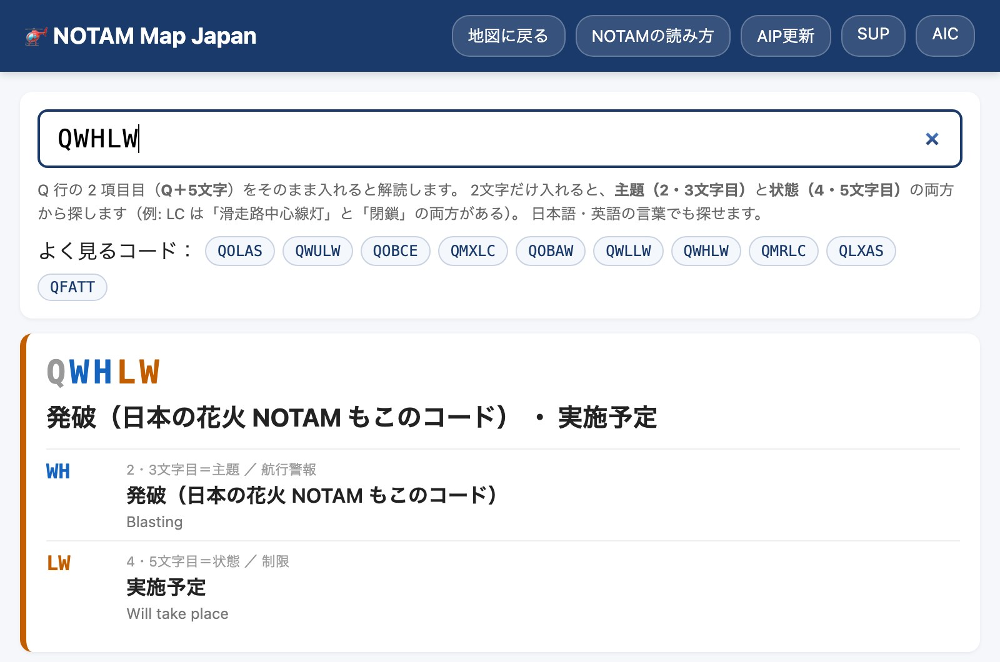

[NOTAM Map Japan](https://notam.heli-coblog.com/) に、NOTAM を「読む」ための2つのページを追加しました。

- 👉 **[NOTAMコード検索](https://notam.heli-coblog.com/notam-code.html)**——Q行の `QMRLC` などを日本語に解読
- 👉 **[NOTAMの読み方](https://notam.heli-coblog.com/notam-guide.html)**——実際の NOTAM を例に、Q行・A〜G項を1行ずつ解説

どちらも登録不要・無料です。

---

## なぜ作ったか

地図に NOTAM を載せると、「どこで」は一目でわかるようになります。ただ、ポップアップを開いて出てくるのは、こういう原文です。

```
Q)RJJJ/QWHLW/IV/M/AW/000/009/3612N13756E001
A)RJAF B)2609190400 C)2609200505
```

`QWHLW` が何なのか、`000/009` の単位は何か、`B)` の時刻は日本時間か——毎日見ていればわかりますが、訓練中の人や、久しぶりに NOTAM を読む人には、ここで引っかかります。

E項（本文）を読めば中身はわかります。それでも、**Q行を読めると、たくさんの NOTAM の中から自分に関係するものを早く拾える**ようになります。そのための道具として作りました。

---

## ① NOTAMコード検索



Q行の2項目目、**「Q＋5文字」をそのまま入れると解読**します。

- **2・3文字目＝主題**（何について）
- **4・5文字目＝状態**（どうなっているか）

に分けて、それぞれ日本語と ICAO の英語の意義を並べて表示します。

### 入れ方はいろいろ

| 入力 | 動き |
|---|---|
| `QMRLC`（Q＋5文字） | 主題と状態に分けて解読 |
| `MRLC`（4文字） | Q を省いてもOK |
| `LC`（2文字） | **主題と状態の両方から**探す。`LC` なら「滑走路中心線灯（主題）」と「閉鎖（状態）」の両方が出ます |
| `滑走路`・`closed` | 日本語・英語の言葉でも探せます |

解読した結果は URL に `?q=QWHLW` のように残るので、**そのままリンクで共有**できます。

### よく見るコード

ページの上部に、日本の NOTAM でよく見るコードを並べました。タップすると解読します。

| コード | 主題 | 状態 |
|---|---|---|
| `QOLAS` | 航空障害灯 | 使用不能（U/S） |
| `QOBCE` | 障害物 | 設置（建設）された |
| `QOBAW` | 障害物 | 完全に廃止 |
| `QWULW` | 無人航空機（ドローン） | 実施予定 |
| `QWHLW` | 発破（日本の花火 NOTAM もこのコード） | 実施予定 |
| `QWLLW` | 自由気球の放球 | 実施予定 |
| `QMRLC` | 滑走路 | 閉鎖 |
| `QMXLC` | 誘導路 | 閉鎖 |
| `QLXAS` | 誘導路中心線灯 | 使用不能（U/S） |
| `QFATT` | 飛行場 | トリガー NOTAM（AIP 改訂版・補足版の発効の周知） |

**花火が「発破（WH）」で出る**のは、初めて見ると戸惑うところだと思います。

### 収録範囲と出典

主題 **179項目**、状態 **79項目**を、灯火施設・航法施設・空域制限・航行警報などのグループに分けて一覧にしています。

英語の意義は ICAO の NOTAM コード表を、**AIM-JAPAN 第11章に掲載されている表と照合**したものです。日本語は私がつけた短い訳で、参考情報です。コードは NOTAM を大まかに分類するためのものなので、**正確な内容は必ず E項（本文）で確認**してください。

---

## ② NOTAMの読み方

実際に発行された NOTAM を1つ取り上げて、**上から順に1行ずつ**読み解くページです。例は、2026年9月の**松本市の花火**の NOTAM にしました。

```
170454 RJAAYNYX
(N3431/26 NOTAMN
Q)RJJJ/QWHLW/IV/M/AW/000/009/3612N13756E001
A)RJAF B)2609190400 C)2609200505
D)19 0400/0405 0800/0805 1000/1005 1100/1200 20
   0000/0005 0300/0305 0500/0505
E)FIREWORKS:
   PLACE: RADIUS 75M CENTER 361143N1375626E
   (MATSUMOTO-SHI IN NAGANO)
F)GND G)886FT AGL)
```

ひとことで言うと「**9月19日〜20日の決まった時間に、松本市の半径75mで、地表から886ft（地上高）まで花火が上がる**」という NOTAM です。

### 載せている内容

| 項目 | 主な内容 |
|---|---|
| **ヘッダー・NOTAM番号** | 発出日時と発信元、シリーズと番号、**NOTAMN・NOTAMR・NOTAMC** の違い |
| **Q行** | 8つの項目（FIR・NOTAMコード・交通・目的・範囲・下限・上限・中心と半径）を1つずつ |
| **A項** | 飛行場の略号に加えて、国内向けの **RJTD（花火・気球など）・RJDR（無人航空機）・ROBL（障害灯）・RJJW〜RJJZ（交通流制御）** |
| **B・C項** | 10桁の日時は **UTC**。日本時間への換算表、`PERM`・`EST` の意味 |
| **D項** | 実施する時間帯。例の NOTAM を日本時間の表に直しています |
| **E項** | 座標の書き方（度・分・秒を詰めて書く）と、よく出る略語 |
| **F・G項** | `GND`・`AGL`・`AMSL`・`FL`・`UNL` |
| **このサイトでの見え方** | 地図の形が E項の座標から描かれているか、Q行の中心と半径から描かれているか |

### 引っかかりやすいところ

書きながら、特に強調したいと思った点です。

- **Q行の範囲は目安でしかない**：Q行の座標は度・分まで、半径は NM の整数なので、この例の花火は実際には**半径75m**なのに、Q行では「**半径1NM**」としか書けません
- **Q行の高さも目安**：`000/009` は100ft単位で、**AGL と AMSL の区別もありません**。正確な高さは F・G項で読みます
- **D項の改行**：例の NOTAM では行末に `20` がぶら下がっています。これは**次の行の時刻にかかる日付**（20日）です
- **日付の境目**：B・C・D項はすべて UTC です。**UTC の15:00以降は、日本時間では翌日**になります

---

## 地図からの入り方

地図の画面からは、次の場所から開けます。

- 画面上部のボタン「**NOTAMコード**」
- 「**機能 ▾**」メニューの「**NOTAMの読み方**」
- 「**？**」（使い方）の一覧

2つのページは互いにリンクしているので、読み方を見ながらコードを引く、という使い方もできます。

---

## おわりに

NOTAM の書式の説明は、ICAO の NOTAM 書式と AIM-JAPAN 第11章の記載をもとに、私がまとめたものです。参考情報として使い、**運航判断は必ず公式の情報源で確認**してください。

わかりにくいところや、「このコードも『よく見るコード』に入れてほしい」といった要望があれば教えてください。

---

## 関連リンク

- [NOTAM Map Japan](https://notam.heli-coblog.com/)——日本全国の NOTAM 地図
- [NOTAMコード検索](https://notam.heli-coblog.com/notam-code.html)
- [NOTAMの読み方](https://notam.heli-coblog.com/notam-guide.html)

### 関連記事

- [ヘリパイロットが毎日使うためにNOTAM地図サービスを作りました（無料・全国対応）](/blog/notam-map-service-2026/)
- [NOTAM Map Japan 大型アップデート（AIC一覧・UI改善・ドローン情報365件など）](/blog/notam-map-major-update-2026/)
- [SWIMでノータムを調べる3つの方法——公式クイックリファレンスがよくできている](/blog/swim-notam-howto-2026/)
- [「RJDR」では出てこない——SWIMで無人航空機のノータムを探す方法](/blog/drone-notam-search-2026/)
